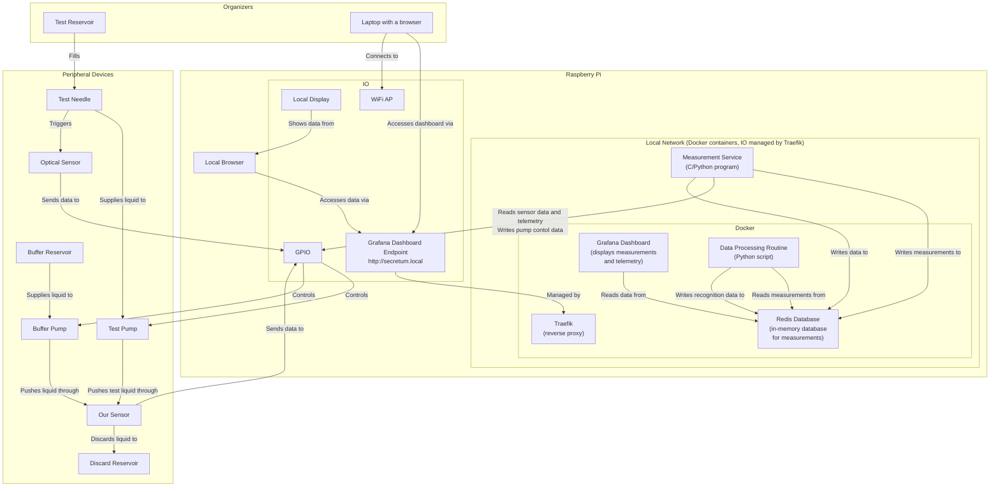

# SecreTUM

## About

This repository contains the code for the SecreTUM project.

## Structure

## TODO

### Controller

- [ ] Check the logic of the controller
- [ ] Test the state machine using the API
- [ ] test the state machine using the Measurement Service

### GPIO

- [ ] Check the plausibility of the GPIO interface
- [ ] Test writing back to the GPIO interface (channel updates)
- [ ] Test Raspberry Pi 5 compatibility

### Measurement Service

- [ ] Figure out how to properly store time series data
- [ ] Figure out required discretization rate

### Data Processing

- [ ] Figure out the shape of the data
- [ ] Figure out how to properly process the data
- [ ] Make sure the data is stored in the Redis database

### API

- [ ] Implement the GPIO API
- [ ] Implement the Measurement API
- [ ] Implement the State Machine API

### Grafana

- [ ] Make grafana load the dashboard from the file system
- [ ] Add sensor data to the dashboard
- [ ] Add state machine data to the dashboard
- [ ] Add pump controls to the dashboard
- [ ] Add recognition data to the dashboard
- [ ] Add mock GPIO controls to the dashboard
- [ ] Measure the total system latency

### Hardware

- [ ] Test the optical sensor
- [ ] Test the Raspberry Pi 5 GPIO interface
- [ ] Assemble the hardware

### Deployment

- [ ] Add a Dockerfile for the Measurement Service
- [ ] Make sure Grafana can be accessed via the local network
- [ ] Make sure API calls do not fail on the local network

